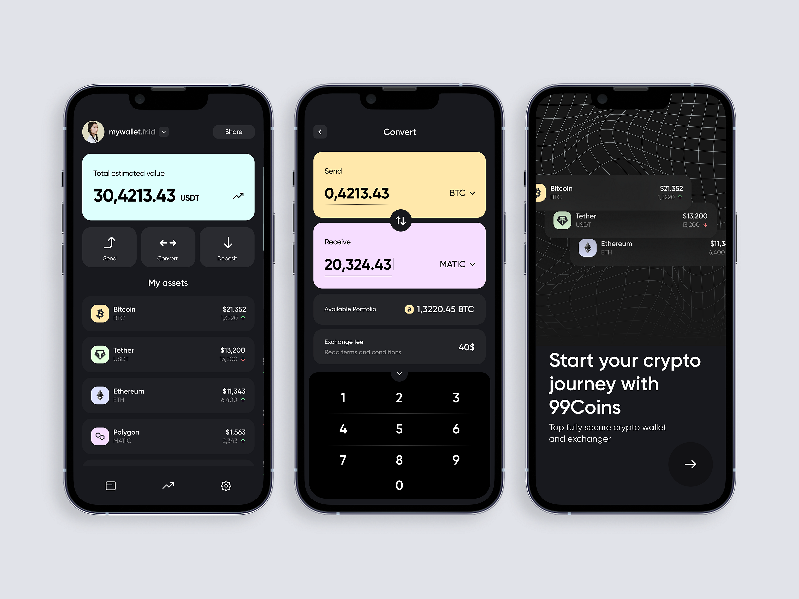
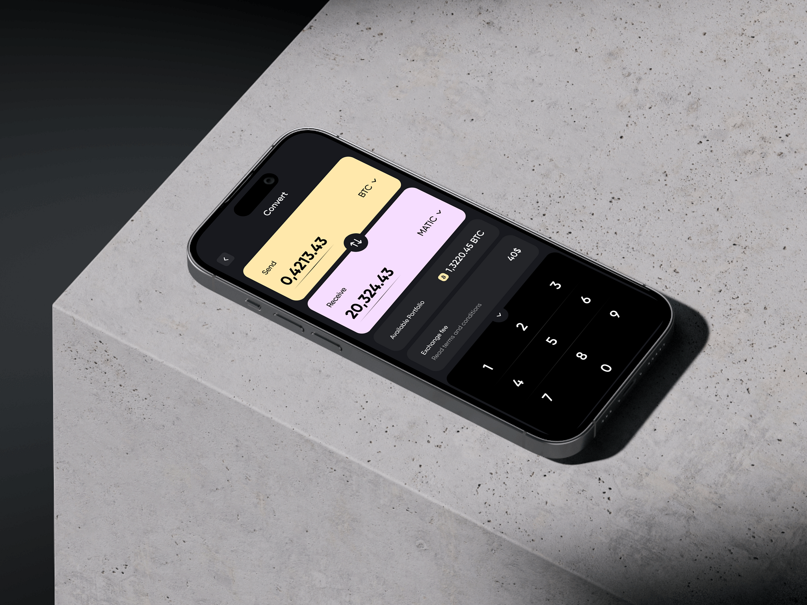
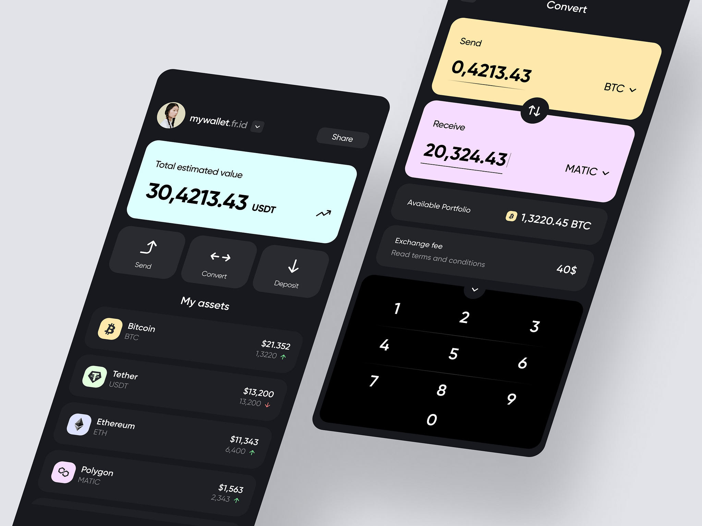

<<<<<<< HEAD
# React + TypeScript + Vite

This template provides a minimal setup to get React working in Vite with HMR and some ESLint rules.

Currently, two official plugins are available:

- [@vitejs/plugin-react](https://github.com/vitejs/vite-plugin-react/blob/main/packages/plugin-react/README.md) uses [Babel](https://babeljs.io/) for Fast Refresh
- [@vitejs/plugin-react-swc](https://github.com/vitejs/vite-plugin-react-swc) uses [SWC](https://swc.rs/) for Fast Refresh

## Expanding the ESLint configuration

If you are developing a production application, we recommend updating the configuration to enable type aware lint rules:

- Configure the top-level `parserOptions` property like this:

```js
export default tseslint.config({
  languageOptions: {
    // other options...
    parserOptions: {
      project: ['./tsconfig.node.json', './tsconfig.app.json'],
      tsconfigRootDir: import.meta.dirname,
    },
  },
})
```

- Replace `tseslint.configs.recommended` to `tseslint.configs.recommendedTypeChecked` or `tseslint.configs.strictTypeChecked`
- Optionally add `...tseslint.configs.stylisticTypeChecked`
- Install [eslint-plugin-react](https://github.com/jsx-eslint/eslint-plugin-react) and update the config:

```js
// eslint.config.js
import react from 'eslint-plugin-react'

export default tseslint.config({
  // Set the react version
  settings: { react: { version: '18.3' } },
  plugins: {
    // Add the react plugin
    react,
  },
  rules: {
    // other rules...
    // Enable its recommended rules
    ...react.configs.recommended.rules,
    ...react.configs['jsx-runtime'].rules,
  },
})
```
=======
# TON Wallet & Shop



**TON Wallet & Shop** — это удобное мини-приложение для Telegram, которое позволяет:

- Покупать товары за TON.
- Обменивать TON на другие токены.
- Отправлять и получать токены в блокчейне TON.
- Легко управлять своим кошельком TON.

## 📱 Возможности приложения

- 🔄 **Обмен токенов** — Быстрый обмен TON и других токенов внутри сети.
- 💰 **Кошелек** — Отправляйте и получайте любые токены с возможностью отслеживания баланса.
- 🛒 **Магазин** — Анонимно покупайте товары за TON с простой авторизацией через TonKeeper.
- 📈 **Управление** — Полный контроль над вашими транзакциями в блокчейне TON.

## 🚀 Технологии

Проект использует современные технологии для интеграции с блокчейном TON и взаимодействия через Telegram:

- **React** — Фронтенд на основе React для быстрого рендеринга интерфейса.
- **TypeScript** — Статическая типизация для улучшенной разработки.
- **Vite** — Быстрая сборка проекта.
- **TonConnect** — Авторизация через TON-кошелек.
- **Zustand** — Управление состоянием приложения.
- **i18next** — Локализация интерфейса.

## 📷 Скриншоты


>>>>>>> dev
